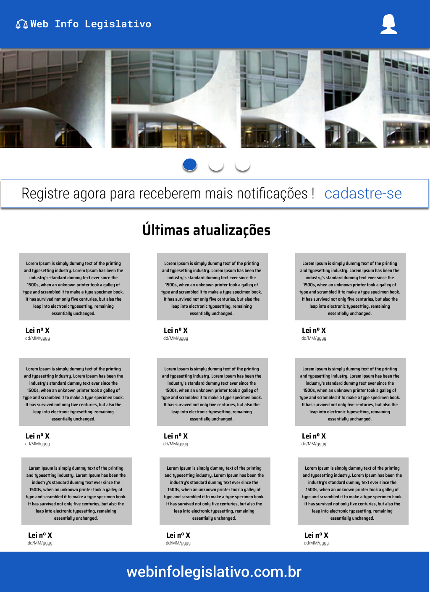
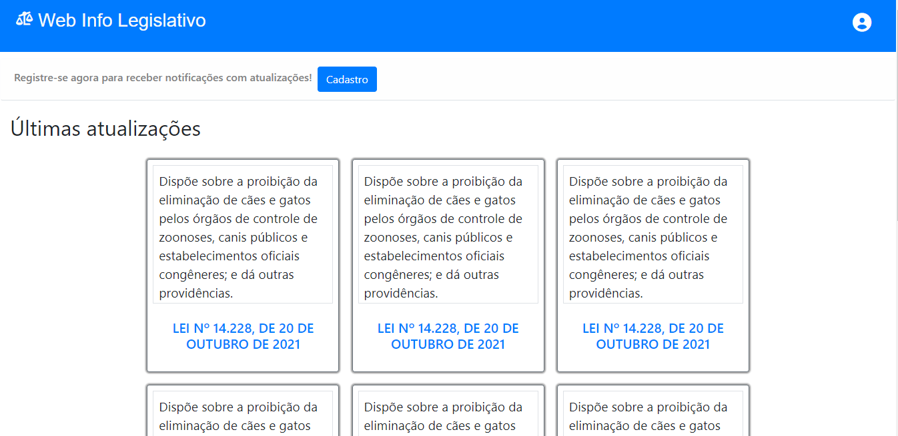
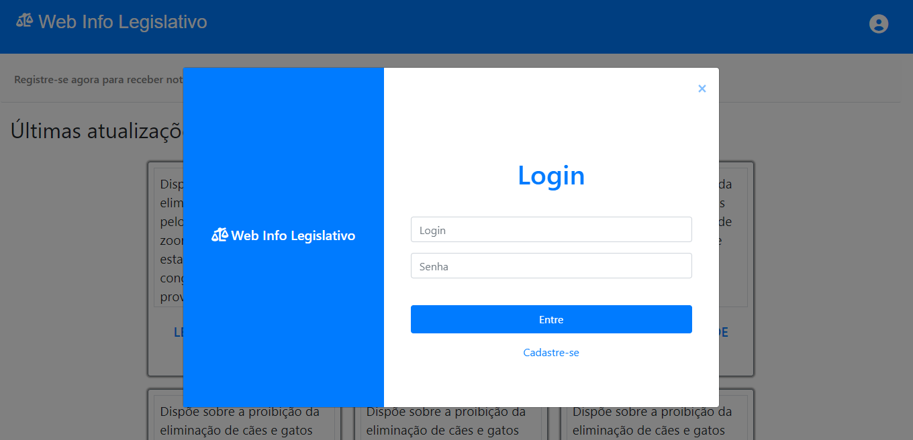

# Template padrão do site

O padrão de layout a ser utilizado corresponde ao projeto de interface
elaborado anteriormente, conforme figura abaixo:

 

##### O template criado está disponível no site <a href="https://www.figma.com/file/RTvAsIfcAWFxAXDGvZIXGe/WireFrame?node-id=0%3A1">Figma</a> e é composto pelos seguintes layouts:
<ul> 
<li style="list-style:none"> <b>1.</b> Tela principal, com exibição das últimas atualizações legislativas e ícone para efetuar login;</li>
 
<li style="list-style:none"> <b>2.</b>Tela modal de login, que surge após pressionar o ícone referido acima.
A responsividade do site segue o padrão do Bootstrap, fazendo com que o
conteúdo do site criado se adapte ao tamanho de tela do usuário.</li>
 
<li style="list-style:none">
<b>6.1</b> Tela Principal</li>
A tela principal foi construída a partir da linguagem HTML, CSS e JavaScript.
Se inicia com a logomarca, o título do site e um ícone para login. Tais elementos estão
dispostos no cabeçalho (header).
Abaixo do cabeçalho, tem-se um elemento article que fornece uma opção para
o usuário fazer o seu registro no site, caso não o tenha.
Após a opção de “registre-se”, está o conteúdo principal do site, que são as
atualizações legislativas. Este conteúdo está no elemento main, que é utilizado para
especificar o conteúdo principal de um documento. Dentro deste elemento, foi utilizada
a estrutura de cards disponibilizada no bootstrap. Cada card, disposto em uma div, se
refere a uma lei que foi atualizada, contendo o respectivo número e um resumo do
que foi atualizado.
As leis atualizadas se apresentam em forma de blocos (cards), que serão
clicáveis e levarão o usuário para a tela com a exibição completa de atualização legal,
com as opções para download em .pdf ou arquivo de texto editável.

 
 

 
 

<li style="list-style:none"><b>6.2</b> Tela Modal</li>
A tela modal é exibida ao clicar no ícone no canto superior direito do header.
Ela se sobrepõe ao conteúdo principal do site. Para sua construção foi utilizado
modelo disponível no Boostrap e é um modal do tipo estático. Veja a figura abaixo:
</ul>

 
 

 
 

No cabeçalho do modal há um ícone de “x”, que possibilita ao usuário fechar a
tela aberta. No corpo do modal, contam dois campos: o de login e o de senha, que o
usuário deve preencher e em seguida pressionar o botão “entre”, logo abaixo. Há
também um link para que o usuário possa efetuar seu cadastro, caso não o tenha. 

O layout da tela modal possui uma barra lateral contendo a logomarca e o nome
do site, seguindo o padrão da tela principal. 
