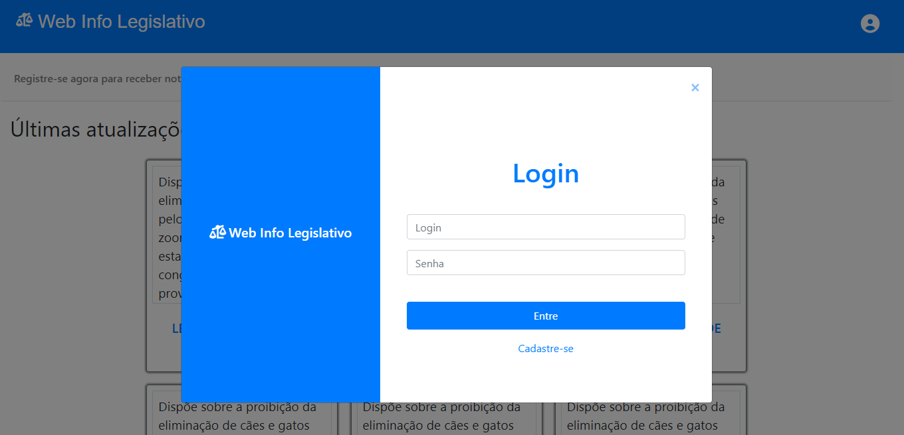

# Programação de Funcionalidades

Nesta seção, são exibidas as telas referentes à construção parcial de algumas funcionalidades elencadas no item 2 deste projeto. Nesta etapa, foram atendidos os seguintes requisitos funcionais:  

* RF-06 O site deve permitir fazer gerenciamento de usuários. 

* RF-07 O site deve exibir na página inicial as últimas alterações legislativas. 

 

#### 7.1 **HOME PAGE** (RF-07): 

 
 

A tela inicial permite ao usuário ter uma visão geral do site e aos resumos das últimas alterações legislativas, que são exibidas em forma de card. Ademais, é disponibilizado ao usuário a opção de registrar-se ou efetuar o login, caso já possua cadastro.

 

##### Artefatos da funcionalidade: 

* Index.html 
* Style.css 

 

#### 7.2 **LOGIN** (RF-06): 

O cadastro e login, que integram o gerenciamento de usuários, é elemento indispensável para acesso ao conteúdo do site. Em regra, o usuário sempre será redirecionado ao modal de login.  

##### Artefatos da funcionalidade:

* Index.html 
* Style.css 

#### 7.3 INSTRUÇÔES DE ACESSO: 

* Faça o download do arquivo do projeto (ZIP) ou clone do projeto no GitHub; 

* Descompacte o arquivo em uma pasta específica; 

* Abra o Visual Studio Code e execute o Live Server; 

Abra um navegador de Internet e informe a seguinte URL: https://icei-puc-minas-pmv-ads.github.io/pmv-ads-2021-2-e1-proj-web-t5-g4-atualizacao-legislativa/ 

 